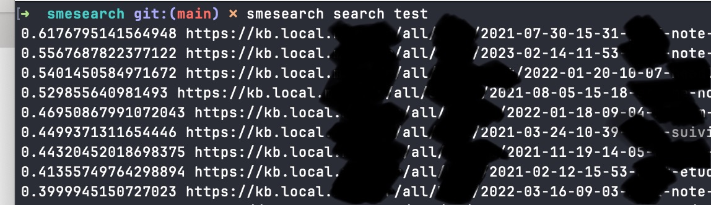

# smesearch


Hugo index for local on promise index and search


# Overview

SMESearch is a module for expose search to hugo website.

This module can search through hugo site with search engine on promise.

For the moment the search can be human type search like keyword or keysentence.

# Capture

Search and index with the cli




Embed smesearch with hugo page / and theme javascript


# Getting started

To enable hugo search you must follow at least these 3 steps.

1. install smesearch binary to your PATH

For example put him in your home binary dir in ~/bin by the following command

```shell
cp smesearch ~/bin

# for ZSH shell
echo 'export PATH=$HOME/bin:$PATH' >> ~/.zshrc

# for BASH Shell

echo 'export PATH=$HOME/bin:$PATH' >> ~/.bashrc

# Also add autocompletion
# For ZSH Shell
echo 'source <(smesearch completion zsh)'

# For Bash shell
echo 'source <(smesearch completion bash)'
```

2. Create index

Relaunch your shell

```shell
# Go to your hugo directory
cd ~/hugosite

smesearch index 
```

3. Search hugo in your shell

```shell
# Research `keyword`

smesearch search keyword
```

## Integrate in your hugo site

### Create a service on OSX

Just launch your Makefile

```shell
make install-plist
```

Or put manually the following command

```shell
	cp smesearch/fr.meyn.search.plist ~/Library/LaunchAgents
	launchctl load ~/Library/LaunchAgents/fr.meyn.search.plist
	launchctl list | grep fr.meyn
```

## Integration in Hugo theme

### Example of integration

```javascript
   document.getElementById("search-btn").onclick = function(e) {
              document.getElementById("res").innerHTML = "";
         var xhttp = new XMLHttpRequest();
              var data = new FormData();
              data.append('q', document.getElementById("search-input").value);
              fetch("https://search.local.meyn.fr:8030/search", {
                  method: 'post',
                  body: data,
              }).then((response) => {
                  if (response.ok) {
                      return response.json();
                  }
                  throw new Error('Something went wrong');
              }).then((responseJson) => {
              document.getElementById("res").innerHTML += '<div class="relative isolate overflow-hidden bg-white px-6 py-24 sm:py-32 lg:overflow-visible lg:px-0">
  <div class="absolute inset-0 -z-10 overflow-hidden">';
                  for (let i = 0; i < responseJson.length; i++) {
                      document.getElementById("res").innerHTML += '<a class="btn bluebtn" href="' + responseJson[i].Location + '">' + responseJson[i].Score + '</a><br/>'
                  }
                  document.getElementById("res").innerHTML += '</div></div>'
              });
         
     };
```
